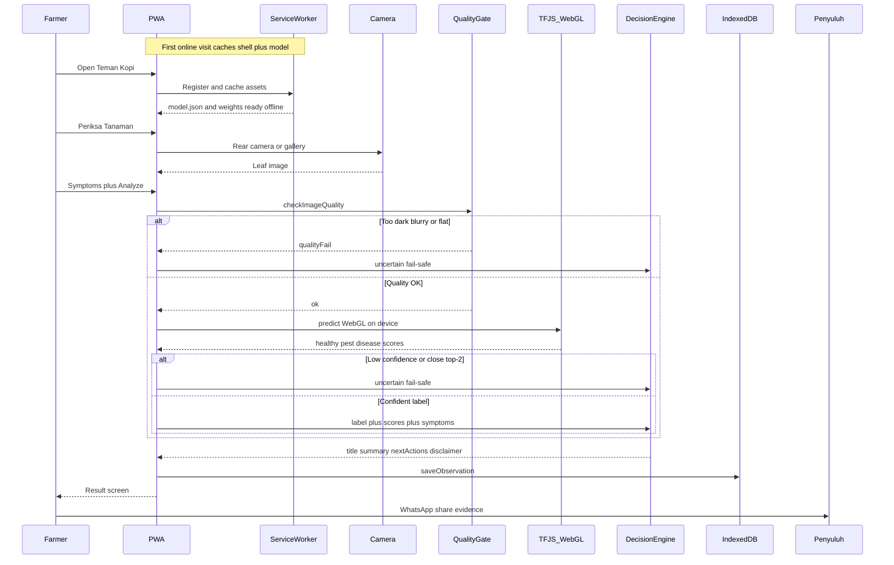

# Teman Kopi

**Production:** https://temankopi.vercel.app

Offline-first **Small AI** PWA for Indonesian coffee farmers — leaf screening on a phone, built for trust, not fake certainty.

## What we built

Teman Kopi is a Progressive Web App that helps a farmer make **one better field decision**: what to do next after seeing a suspicious leaf. On-device vision (**MobileNetV3Small** via **TensorFlow.js / WebGL**) screens a photo as healthy, pest-like, or disease-like. Observations save locally in **IndexedDB**; a service worker caches the model so screening still works without a network after the first visit. Bahasa Indonesia and English UI, installable on a phone like an app.

## Problem

In the coffee plot, farmers often notice spots or damage but lack a clear next step. Guessing wastes time and erodes **trust** in advisory — especially when tools invent diagnoses or spray recipes without evidence. Labeled Indonesian leaf datasets for pest/disease screening are still limited, so confident “AI diagnosis” would be dishonest. Phones are common; national registries are not required for this MVP — what matters is cautious screening plus a bridge to a **penyuluh** (extension officer).

## Solution

Photograph the leaf, add symptoms, analyze **on-device** (no cloud API for inference). Photo quality and confidence gates fail safe to “not sure enough” instead of guessing. Rule-based next steps (not an LLM) guide observation and handoff; WhatsApp shares evidence to an extension officer. Training uses open **DECAFIA / CoffeeLeaf-CO** only, with an honest domain-gap story and a path to local Indonesian field photos.

**Slogan:** Save time · Keep trust / Hemat waktu · Jaga kepercayaan

## End-to-end flow



Presentation slides: [hackathon-videos/sequence-flow.html](hackathon-videos/sequence-flow.html) · [hackathon-videos/tech-slide.html](hackathon-videos/tech-slide.html)

## Stack highlights

- On-device vision: TF.js graph-model (DECAFIA / CoffeeLeaf-CO), WebGL
- Fail-safe: uncertain → ask a penyuluh / extension officer (no pesticide doses)
- IndexedDB observations + store-and-forward sync demo
- No backend required for the MVP

> If the URL asks you to log in to Vercel, disable **Deployment Protection** for this project (Settings → Deployment Protection → Standard Protection off for Production), so phones can open/install the PWA.

## Develop

```bash
npm install
npm run dev
# Optional synthetic model only: npm run train:bootstrap
# Production weights live in public/models/teman-kopi/ (DECAFIA export)
```

## Demo checklist (judges)

1. Open https://temankopi.vercel.app on phone (install PWA if prompted)
2. Airplane mode ON
3. Check Plant → capture photo → symptoms → Analyze (local TF.js)
4. See next actions + disclaimer (not a diagnosis)
5. Save → History
6. Blurry/dark photo → **Uncertain — ask extension officer**
7. Go online → Synchronize now
8. About Model → story (Indonesia data gap) + DECAFIA-only training source

## Train on DECAFIA (recommended for field accuracy)

1. Use `/path/to/decafia.zip` (CoffeeLeaf-CO / Zenodo) — verified OK  
2. See [training/README.md](training/README.md) or `training/colab_train_teman_kopi.ipynb`  
   - **Colab:** steps 1–5 only → download `teman_kopi_keras.keras`  
   - **Local:** TF.js export with Python 3.11/3.12 + `tensorflowjs` (not Colab)

```bash
# After downloading the Keras file from Colab (Python 3.11/3.12 venv):
python training/export_tfjs.py --model /path/to/teman_kopi_keras.keras --out public/models/teman-kopi

# Or full local train + export:
python3.11 training/prepare_decafia.py --source /tmp/decafia_raw --out training/data/decafia_remapped
python3.11 training/train.py --data-dir training/data/decafia_remapped --out training/artifacts/teman_kopi_keras.keras
python3.11 training/export_tfjs.py --model training/artifacts/teman_kopi_keras.keras --out public/models/teman-kopi
```

## Deploy

Everyday: **push or merge to `main`** — Vercel Git integration auto-deploys production (see [DEPLOY.md](DEPLOY.md)).

`npm run build` stamps `public/sw.js` with a cache name hashed from `public/models/teman-kopi/*`, so a new model busts the PWA cache after users open the site online once (no clear-data step).

TF.js ships a **graph-model** export (Keras 3 MobileNetV3 layers JSON is not TF.js-compatible). App loads it with `tf.loadGraphModel`.

Manual fallback only:

```bash
npm run build
npx vercel --prod --yes
```
