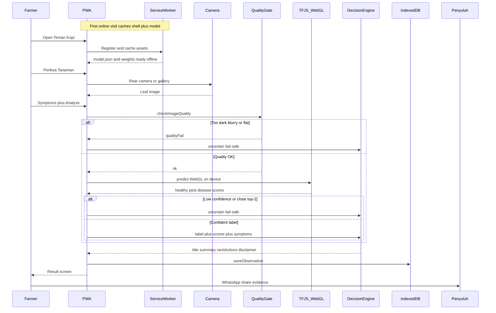

# Teman Kopi — end-to-end sequence (tech walkthrough)

Screen-record [`sequence-flow.html`](sequence-flow.html) fullscreen (open online once so Mermaid CDN loads). Pair with the tech VO in [`../HACKATHON_VIDEO_SCRIPTS.md`](../HACKATHON_VIDEO_SCRIPTS.md).

Training (spoken only, see [`tech-slide.html`](tech-slide.html)): DECAFIA → MobileNetV3Small → TF.js export → `public/models/teman-kopi/`.

## Sequence

## VO beat cues (map while recording)

| Beat | Say (short) | Diagram focus |
|------|-------------|----------------|
| 1 | Small AI on the edge — no cloud API for analysis | Cache / SW |
| 2 | Capture leaf → quality gate | Camera → QualityGate |
| 3 | TF.js + WebGL on device → three-class scores | TFJS_WebGL |
| 4 | Low confidence → fail-safe, not a fake diagnosis | alt uncertain |
| 5 | Rule-based next steps → IndexedDB → penyuluh | Decision → DB → Ext |

Keep total spoken tech script ≤60s; use this diagram as the visual, not a second long VO.
